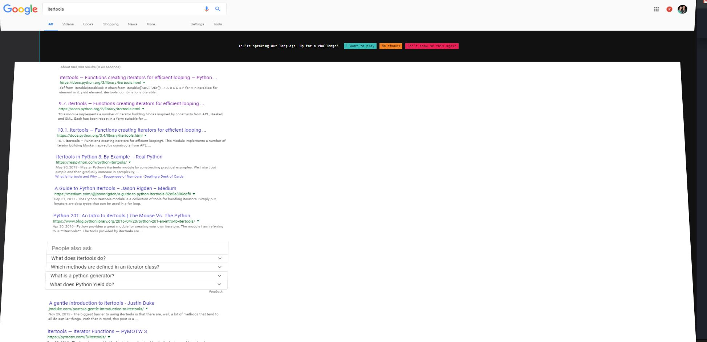
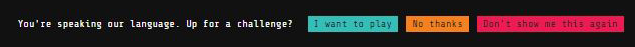
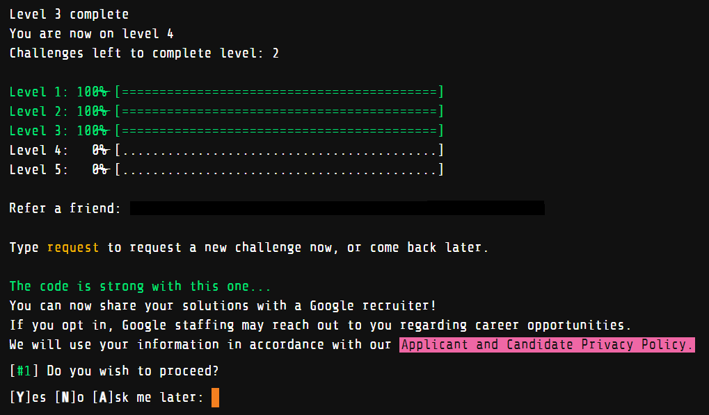
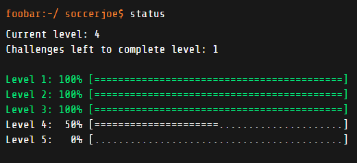

\* *The Google Foobar challenge is a secret recruiting challenge given to individuals who search for certain programming terms in Google. More information can be found [here](https://www.geeksforgeeks.org/google-foo-bar-challenge/). I am currently on the second challenge in Level 4. I wanted to outline my experience thus far and give advice on how to approach each level. I plan on updating this article when I have completed the whole challenge.*

Last fall, as I was preparing a presentation on how to write cleaner, more pythonic code for my Python Working Group, I got an odd message with my search results.

The message reads "You're speaking out language. Up for a challenge?". Of course I quickly clicked "I want to play". This brought me to a linux-like terminal with the welcome message: "Success! You've managed to infiltrate Commander Lambda's evil organization, and finally earned yourself an entry-level position as a Minion on her space station. From here, you just might be able to subvert her plans to use the LAMBCHOP doomsday device to destroy Bunny Planet. Problem is, Minions are the lowest of the low in the Lambda hierarchy. Better buck up and get working, or you'll never make it to the top..."

### Structure of the Challenge

Using the "ls" command show that journal.txt, and start_here.txt are two files in your directory. The journal.txt file contains the welcome text, and gets updated after every completed challenge. The start_here.txt tells use to "Type request to request a challenge. Type help for a list of commands." Typing help in the terminal shows a list of valid commands:

Once you have requested a challenge using the "request" command, a folder appears in your directory with a text file that contains a description of the challenge as well as a couple of test cases. In the same folder, there is also a solution.py file and a solution.java file. You can choose to code in either Java or Python for each challenge.

Once you have come up with a solution, you can verify your solution with the "verify" command. Google will check your code with multiple test cases (most of which are hidden). If you pass all the test cases, you can either submit your solution, or refactor and clean up your code and reverify it. Submitting a correct solution results in a new journal entry in your journal.txt file. You don't have to do the challenges all at once. I actually recommend that you request a new challenge when you feel ready and have enough time to complete it.

Let me tell you about the structure of the whole challenge. There are 5 levels. The following table shows how many challenges there are in each level as well as the time given for each challenge:

| Level  | Number of Challenges | Time given for each Challenge | Reward for Level Completion |
| :--- | :---   | :---   | :--- |
| 1 | 1 | 48 hours | |
| 2 | 2 | 72 hours | Friend referral link |
| 3 | 3 | 96 hours | Google recruit survey |
| 4 | 2 | 360 hours| ?? |
| 5 | 1 | ?? | ?? |

### Level 1

I requested my first challenge and got working. I was given 48 hours to complete the challenge. I will not share what exactly the challenge was, but it would have been fairly easy for anyone who had completed an introductory computer science course. I submitted my solution within the half hour I received the challenge (as I believed that I had 48 hours to complete all challenges). I got a new message that was added to my journal.txt file and could then request a challenge from level 2.

### Level 2

Level 2 challenges got progressively harder, but I was given enough time to complete each challenge. As opposed to level 1, level 2 contained challenges that were more "puzzle-like". The key to each challenge was to identify the "pattern" and check for edge cases. After completing the challenges in level 2, I found that I could probably not get by with just my "introductory" computer science knowledge. So, I purchased [Introductions to Algorithms](https://www.amazon.com/Introduction-Algorithms-Press-Thomas-Cormen-ebook/dp/B007CNRCAO/ref=sr_1_8?crid=35TWIYDTPEIDQ&keywords=data+structures+and+algorithms&qid=1562026055&s=gateway&sprefix=data+structures+a%2Caps%2C230&sr=8-8) (also known as CLRS) and began to study it. Finding time to study was difficult as I still had PhD commitments (researching, teaching, and taking classes) as well as family commitments, but I eventually felt comfortable enough to use different data structures and algorithms to solve problems efficiently. I also used [leetcode](https://leetcode.com/) to practice my newfound knowledge.

### Level 3

After feeling comfortable I ventured onto Level 3. All three challenges in this level were not too difficult (and I could usually come up with a solution fairly quickly). Even though I was fairly confident that my code was correct, I usually could not pass all of the checks as my code either timed out, or I did not account for some edge cases. The fun (and often stressful) part of this level was to think of different data structures and/or algorithms that would circumvent the time-out problem. I submitted all three challenges in this level in the matter of about a week or two. I don't recommend others do this as you want to submit code that is both clean and optimized. I just submitted quickly as I have other priorities I have to attend to.

After completing level 3 (late spring, early summer), I was asked if I wanted to be contacted by a Google recruiter. Of course I did! I filled out a brief survey, and a Google recruiter contacted me about a week later. He requested my resume, and gave me the option to apply for the fall 2019, winter 2020, and summer 2020 software engineering internship. I chose the summer 2020 internship. He notified that Google does not start the hiring process for summer 2020 until August, but that he would contact me when August rolled around.

### Level 4

Even though I was contacted by a recruiter, I thought I would try my hand at level 4. So far, I have only completed the first challenge in this level. This challenge was different than the challenges in the previous levels as "conventional" data structures and algorithms could not be used. The problem I got reminded of a NP-hard problem I learned from CLRS. I completed the challenge by modifying the inputs (I don't want to go into too much detail), and using brute force. I was surprised when I was able to pass all of the test cases.

### What next?

I have not been able to request the last challenge in level 4 as I have been pretty swamped this summer. I plan on (hopefully) completing the next challenge before fall classes start. Even if this Google Foobar challenge does not result in a job at Google, it has been a worthwhile experience that has helped me to grow a lot as a programmer and a critical thinker over a short period of time. Anyone who gets the secret invitation from Google to do this challenge should not hesitate to click "I want to play".