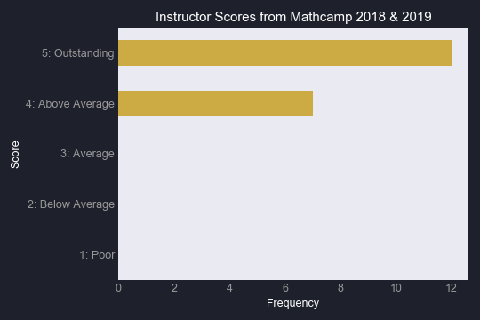

<!-- Maybe add a description of some sort? -->
<!--
#### [PhD Math Bootcamp]({{ site.baseurl }}/teaching/math_bootcamp_2019) (ECONS 506)

> The course covers topics including: Proofs, Set Theory, Real Analysis, Linear Algebra, Multivariate Calculus, and Optimization.\\
> [Click here for the current Math Bootcamp (Summer 2019)]({{ site.baseurl }}/teaching/math_bootcamp_2019)\\
> [Click here for last year's Math Bootcamp (Summer 2018)]({{ site.baseurl }}/teaching/math_bootcamp)

#### [Master's Math Bootcamp]({{ site.baseurl }}/teaching/masters_math_bootcamp_2019) (ECONS 526)

> The course covers topics including: Single Variable Calculus, Multivariate Calculus, Linear Algebra, and Optimization.\\
> [Click here for the current Math Bootcamp (Summer 2019)]({{ site.baseurl }}/teaching/masters_math_bootcamp_2019)

#### [Sports Economics]({{ site.baseurl }}/teaching/321) (ECONS 321)

> Economic aspects of American sports; fan demand; advertising; team output decisions; league/conference organization; government and sports.\\
> Winter 2017, Winter 2018

#### Labor Economics (ECONS 323) (Created and developed online course)

> Functioning of labor markets; introduction to collective bargaining and labor law.\\
> Fall 2017 (TA), Summer 2018

#### [Python Working Group]({{ site.baseurl }}/teaching/python)

> Community griven group with weekly presentations given by its members.\\
> Active member and presenter

-->

## Awarded School Of Economic Sciences 2019 Excellence in Teaching Award

### Latest Instructor Reviews

<!--[PhD Mathcamp 2018](../../assets/pdfs/mathcamp_2018.pdf): **4.7/5.0**-->
+ PhD Mathcamp 2018: **4.7/5.0**

+ [PhD Mathcamp 2019](../../assets/pdfs/mathcamp_2019.pdf): **4.5/5.0**

### Selected Student Comments: 

> The professor covered the vast material well. Having studied much of this material previously, I was impressed by his ability to easily convey the quantity of the material presented while highlighting many of the nuances required to apply the material. 

> The instructor was diligent with writing out information on the whiteboard, which was helpful for visualizing what I was learning and for taking notes. 

> It was a great course that was taught well. I can't think of anything to change.

> The instructor was relaxed, confident, and knowledgeable. Did not judge students for any question.

 

## Courses

  

    <a href="/teaching/math_bootcamp_2019" class="card">
      

      
      <article>
        <h1>PhD Math Bootcamp</h1>
        
Summer 2018, Summer 2019

        ECONS 506
      </article>
    </a>
  

  

    <a href="/teaching/masters_math_bootcamp_2019" class="card">
      

      
      <article>
        <h1>Master's Math Bootcamp</h1>
        
Summer 2019

        ECONS 526
      </article>
    </a>
  

  

    <a href="/teaching/321" class="card">
      

      
      <article>
        <h1>Sports Economics</h1>
        
Winter 2017, Winter 2018

        ECONS 321
      </article>
    </a>
  

  

    <a href="/teaching/labor_econ" class="card">
      

      
      <article>
        <h1>Labor Economics</h1>
        
Fall 2017 (TA), Developed Online Summer 2018

        ECONS 323
      </article>
    </a>
  

  

    <a href="/teaching/python" class="card">
      

      
      <article>
        <h1>Python Working Group</h1>
        Python
      </article>
    </a>
  

  
  

  

